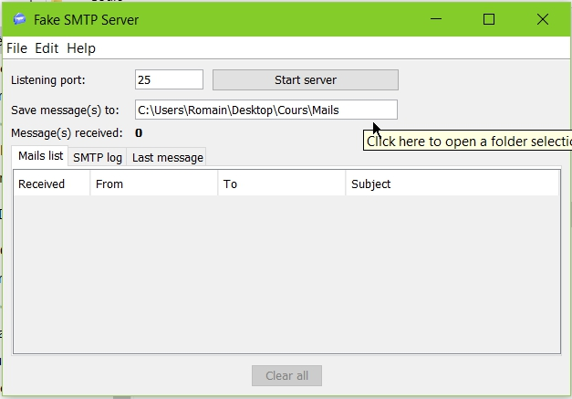
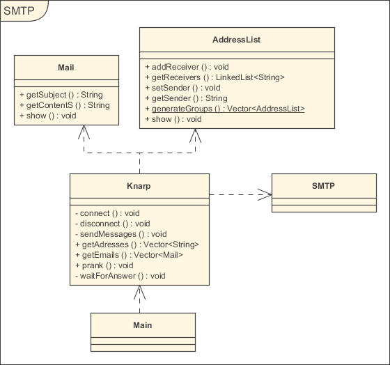

# Rapport Labo SMTP

## Description du projet

Le but de ce projet est de réaliser une application permettant d'envoyer automatiquement des e-mails forgés en utilisant les fonctionnalités d'un serveur SMTP (ici, un mock). 

## Fonctionnement de l'application

Il suffit de:

1. Remplir les différents fichiers de configuration

* server.xml : contient les paramètre de connexion au serveur
* email_addresses.xml : contient une liste d'adresses e-mail
* email_content.xml : contient une liste d'e-mails (sujet et contenu) à envoyer

2. Lancer l'application
3. Entrer le nombre de groupes à créer

## Installation du serveur SMTP

Le Mock SMTP utilisé ici est FakeSMTP (https://nilhcem.github.io/FakeSMTP/download.html) pour sa simplicité d'utilisation.

* **Installation:** Il suffit de le télécharger à l'adresse donnée ci-dessus, de décompresser l'archive *.zip, puis de placer le *.jar où on le souhaite (par exemple sur le Bureau) et de l'exécuter
* **Mise en oeuvre**: Une fois le programme lancé, il suffit de déterminer à quel endroit le mails reçus seront enregistrés dans le champs prévu à cet effet, et de lancer le serveur ("Start server").
* **Connexion:** Une fois lancé, on peut s'y connecter (en telnet, par exemple) à l'adresse "localhost" sur le port 25.

## Diagramme de classes et description des classes

### Main
Cette classe ne fait que créer l'objet de génération avec les fichiers de configuration définis en constantes,  demander à l'utilisateur le nombre de groupes à créer, puis lancer la génération.

### SMTP
Ne contient que les commandes SMTP nécessaires au fonctionnement du serveur SMTP

### Mail
Permet de stocker les différents mails à choix (sujet et contenu du mail)

### AdressList
Cette classe stocke des listes d'envoi: un emetteur et une liste de récepteurs.
Elle permet en plus de créer une liste de listes d'envoi grâce à une méthode statique prenant une liste d'adresses (en String) en paramètre

### Knarp
Classe principale de l'application. Gère automatiquement toutes les étapes de la création des groupes et de l'envoi des mails (tout géré dans la méthode prank): 
* Lecture du fichier d'adresses
* Lecture du fichier de mails
* Génération de groupes d'envoi de mails avec un émetteur et une liste de récepteurs
* Envoi d'un mail (choisi au hasard) aux listes de mails

## Auteurs
Thibaut Loiseau & Romain Mercier
